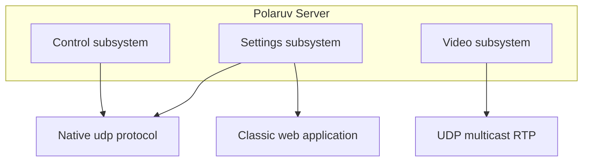
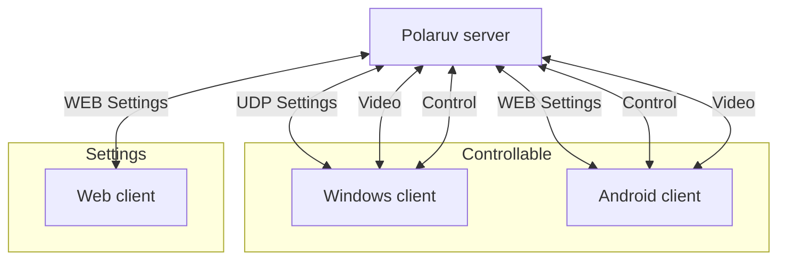

README: Eng, [Rus](README.ru.md)

# PolarUV platform

[Releases](https://github.com/PolarUV/polaruv/releases)

[Issues](https://github.com/PolarUV/polaruv/issues)

# PoalrUV clinet

[Installation guide](https://github.com/PolarUV/polaruv/wiki/Client) (wip)

# PolarUV robot

[Intallation guide](https://github.com/PolarUV/polaruv/wiki/Robot) (wip)
